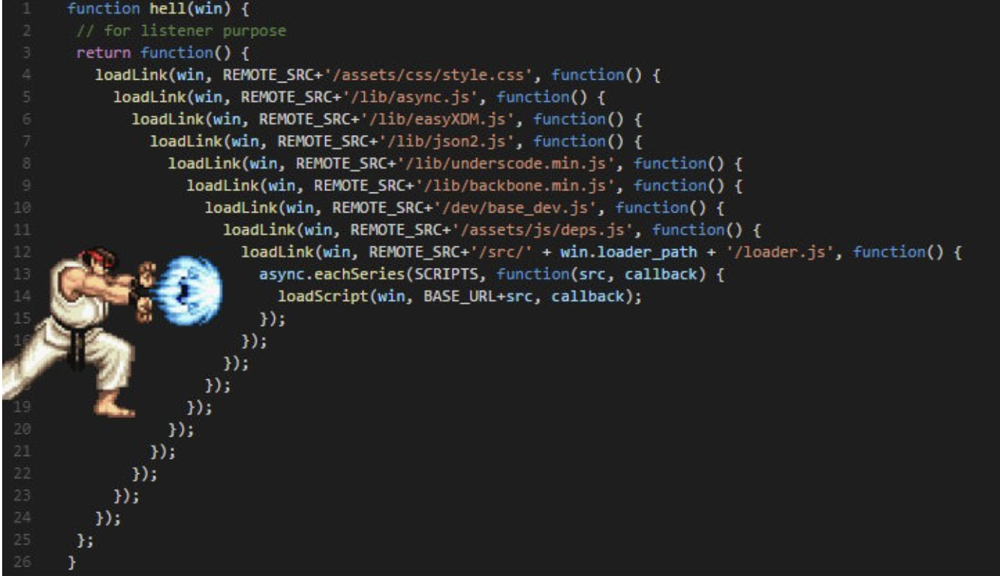

意思是每件事情不依賴彼此結束才進行，例如在網頁中向伺服器發出請求，在等待的時間不會阻塞其他進程

> 像這樣處理事件的流程不會被「卡住」，就是非同步 (Asynchronous) 的概念。

> JS 是單執行緒的語言，為了處理非同步問題，因此發展了事件循環
> 為了實現非同步可以用以下三個方法：

## Callback

```javascript
var funcA = function () {
  var i = Math.random() + 1;

  window.setTimeout(function () {
    console.log("function A");
  }, i * 1000);
};

var funcB = function () {
  var i = Math.random() + 1;

  window.setTimeout(function () {
    console.log("function B");
  }, i * 1000);
};

funcA();
funcB();
```

在這個範例中，我們讓兩個 fn 隨意的 setTimeout ，所以我們無法預測 function A、function B 誰先出現

過去常見的做法，會將**後續要做的事**透過參數的方式傳給另一個函式，以確保在原本的函式執行後才去呼叫

```javascript
var funcA = function (callback) {
  var i = Math.random() + 1;

  window.setTimeout(function () {
    console.log("function A");

    // 如果 callback 是個函式就呼叫它
    if (typeof callback === "function") {
      callback();
    }
  }, i * 1000);
};

var funcB = function () {
  var i = Math.random() + 1;

  window.setTimeout(function () {
    console.log("function B");
  }, i * 1000);
};

// 為了確保先執行 funcA 再執行 funcB, 呼叫 funcA() 的時候，將 funcB 作為參數帶入
funcA(funcB);
```

所以當有太多需要固定「回去呼叫」的函式時，就可能出現 callback hell


## Promise

> 在 HTML5 的 WebAPI 標準中，event loop 新增了微任務序列（micro task queue），Promise 正是透過微任務序列來驅動的

> 微任務觸發時機：在 Stack 清空時，JavaScript 引擎會先確認微任務序列有沒有東西，有的話就優先執行，直到清空後，才從 Queue 拿出新任務到 Stack 上

### Why Promise?

為了避免 callback hell，ES6 以後為了解決同步/非同步問題，新增了一個特殊物件-promise

### What is Promise?

按字面翻譯就是「承諾、約定」的意思，回傳結果有完成或是拒絕；

Promise 物件有三種狀態：

pending / fulfilled / rejected

## 當 Promise 被完成時，我們可以呼叫 resolve()，將取得的資料傳遞出去

**要提供一個函式 promise 功能，讓它回傳一個 promise 物件即可：**

```javascript
function myAsyncFunction(url) {
  return new Promise((resolve, reject) => {
    // resolve() or reject()
  });
}
```

延續 Callback 裡的例子，可以這樣改寫成 Promise：

```javascript
var funcA = function () {
  return new Promise((resolve, reject) => {
    var i = Math.random() + 1;

    setTimeout(function () {
      console.log("function A", i);
      resolve("A");
    }, i * 1000);
  });
};
var funcB = function () {
  return new Promise((resolve, reject) => {
    var i = Math.random() + 1;

    setTimeout(function () {
      console.log("function B", i);
      resolve("B");
    }, i * 1000);
  });
};

funcA().then(funcB);

// 若想接到 funcA/funcB 裡的結果
funcA()
  .then((res) => {
    console.log("res", res);
    return funcB();
  })
  .then((resB) => {
    console.log("resB", resB);
    console.log("全都好了");
  });
```

就可以達成等到 funcA 被 resolve 再執行 funcB
如果不在乎 funcA, funcB 誰先誰後，可以用 promise.all()

```javascript
Promise.all([funcA, funcB]).then(() => {
  console.log("全都好了！");
});
```

## async/await

一年過去，ES7 規範了新的 async/await（promise 的語法糖）

一樣來改寫上一個 promise 的範例：

```javascript
var funcA = function () {
  return new Promise((resolve, reject) => {
    var i = Math.random() + 1;

    setTimeout(function () {
      console.log("function A", i);
      resolve();
    }, i * 1000);
  });
};
var funcB = function () {
  return new Promise((resolve, reject) => {
    var i = Math.random() + 1;

    setTimeout(function () {
      console.log("function B", i);
      resolve("B");
    }, i * 1000);
  });
};

async function main() {
  await funcA();
  await funcB();
  console.log("全都好了");
}
```

在最後呼叫 funcA & funcB 前都加上 await ，就可以確保 funcA 完成 →funcB 完成 →console()
