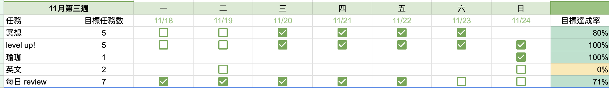

上週一二一如往常沒有早起，週三到週五才慢慢恢復，記得之前有看過大腦會記憶我們睡覺的時間，但是因為它很懶，所以如果你週日白天 12 點才醒，他也會以為你週一也要 12 點醒，於是週一會覺得特別難起床，於是上週試著練習假日也是 10:30-11:00 上床，早上六七點起來，果然這個禮拜一有順利起床了。

推薦大家這兩個影片：

[坚持 5 点起床一年, 我搞懂了早起改变人生的秘密](https://www.youtube.com/watch?v=4zXTyc2ZjXM)

[堅持 5 點起床『第二年』,我都干了點啥？](https://www.youtube.com/watch?v=R0L3U0HRYGA&t=330s)

**關於學習**

上週因為在讀 JS 觀念題因緣際會查到了胡立大大的學生的筆記，意外發現胡立之前的程式導師計畫（其實以前就知道，但並沒有仔細看過課綱），雖然已經結束了，不過他有把課綱和教學資源放在網路上，好奇隨手做了一個前端加強班的課程，是一個接 Twitch api 的直播遊戲介面，可以先做完當日任務再去看胡立是怎麼解的，看完完全被胡立圈粉，原來高手連切版都這麼高竿！而且雖然沒有用到什麼難的技術，但都是一些基本但觀念容易模糊的小觀念，覺得像挖到寶一樣，讓我週末早上興奮的起床寫 XD

**關於 me time**

最近因為籌備婚禮，有好多假日都忙忙的，很少有自己的時間，上週末終於有一點自己的時間，寫了胡立的作業、市場買菜、上瑜伽課、第一次燉紅燒牛腩飯，甚至久違的去跑了步，是幸福的一天

**take away**

1. 保持盡量每天穩定的睡眠、起床時間，讓身體幫助我們早起而不只使單靠意志力

2. 每週至少保持一天空無一事，可以隨心安排，會讓我感到很充電
