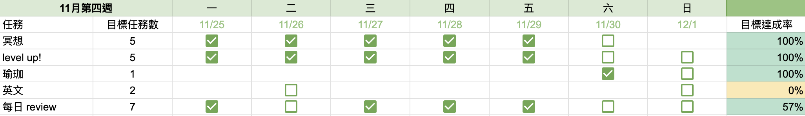

首先先恭喜我自己上週每天都有早起～～\
發現自己的情緒真的是容易被他人影響，尤其是看到他人擁有自己沒有的東西時，會瞬間落入懷疑自己的大海裡，所以啊，把自己的北極星列出來貼在牆上真的是很重要

### 關於學習

上週一樣在念胡立的課，發現蠻多以前覺得需要硬背的觀念，其實在了解原理後都是可以通的！這大概是我近期上的蠻開心的課，比較知道自己在幹嘛，再學習的道路上好像漸漸清晰了

### 關於生活

下週唱歌課終於要告一段落了，上的算是開心，不過比較偏向理論，下次想上「街頭表演實戰班」，應該會更有趣一點。

這兩天一樣是在準備婚禮影片和排版照片，幾乎都有 on time ，影片只剩一點要修正，我覺得我 hen 棒

### 關於職涯

上週我的另一個前端同事開始做後端的 ticket 了，一開始有點小緊張，後來跟他聊完後有舒服很多，因為同事已經寫了五年的前端，接下來希望能轉到後端，所以向主管提出想開始學後端；反觀我自己，接下來的職涯想得沒有很清楚。

想到前幾週讀到胡立的文章《讓前端成為選擇》，裡面寫道對於前端工程師來說，懂後端是好事，並不是一定要在工作上寫後端，但可以讓自己更了解整個網頁運作的原理，也很符合之前我看到的文章寫道：_在成為前端工程師之前，必須要先成為一位軟體工程師_。

所以接下來我希望成為「懂後端的資深前端」，讓自己可以解決的問題更多，具體的方法會先從胡立的課開始（我訂閱了他的課程三個月），希望能在之前囫圇吞棗的過程中更加扎實的學習，成為一位 solid 的軟體工程師。
